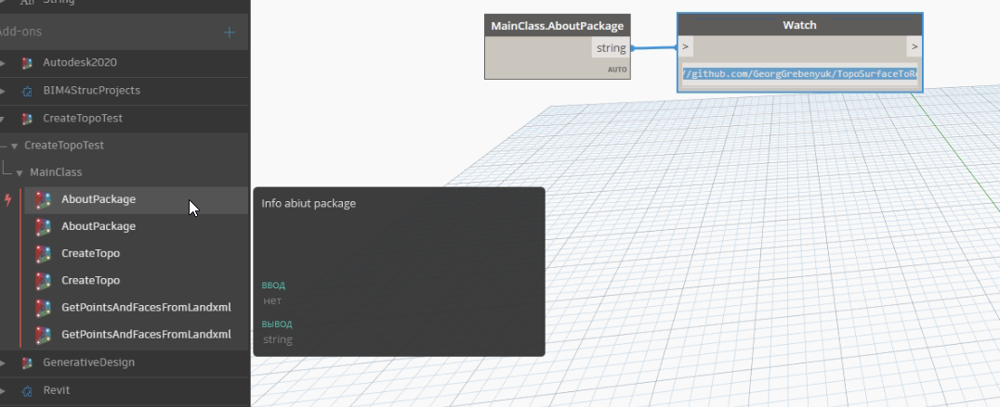
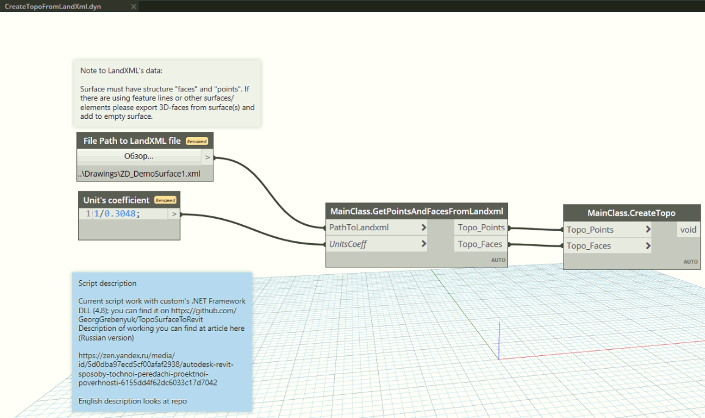

# TopoSurfaceToRevit
Repo with code for Autodesk dynamo package to create Revit's surface from initial landxml file

Russian version  read at [that guide](ReadMe_Rus.md)

About history of problem read (that my article)[https://zen.yandex.ru/media/id/5d0dba97ecd5cf00afaf2938/autodesk-revit-sposoby-tochnoi-peredachi-proektnoi-poverhnosti-6155dd4f62dc6033c17d7042] (only in Russian)

## Using
Package can be used by two ways: as Dynamo's package (download via Dynamo package manager) and as local-imported library in Dynamo (where there are not Internet-connection). Standard way (via Dynamo package manager) presented below:

Alternative way - import to dynamo as custom library ([files from that folder](01_Code/bin/Debug))

After installing there are some nodes in package's structure:

Note: at screen there are copies of nodes, because I use debug-version and package's.

Dynamo script you can find [in file](CreateTopoFromLandXml.dyn)

## Development and compiling
Package is contain a minimum of Revit'a API methods (create Toposurface from points and faces and get coordinates of Revit's survey point). Other methods - is .NET classic code. Project is builded to .NET Framework 4.8 to Revit 2021. Run CreateTopoTest.sln to compile project.

