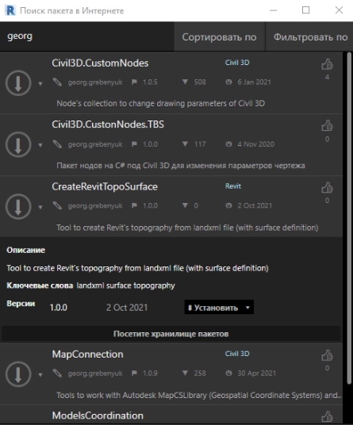
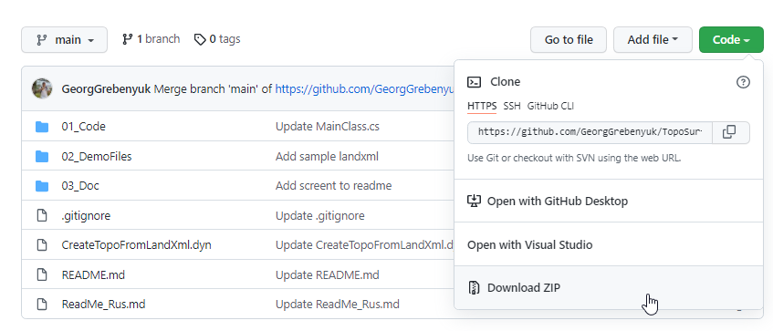
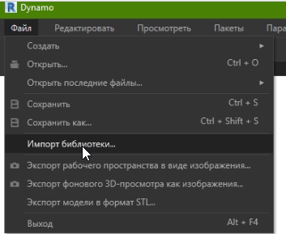
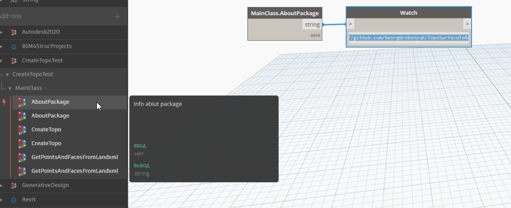
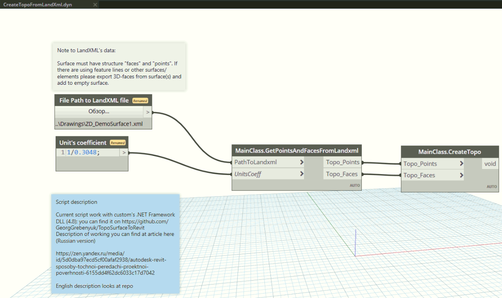

# TopoSurfaceToRevit
Repo with code for Autodesk dynamo package to create Revit's surface from initial landxml file
Репозиторий с кодом для библиотеки под Autodesk Dynamo для Revit для моделирования топо-поверхности по файлу landxml

Английская версия расположена [здесь](ReadMe.md)

С истоией вопроса (случаем передачи в Revit точной топоповерхности можно ознакомиться в (приведенной статье)[https://zen.yandex.ru/media/id/5d0dba97ecd5cf00afaf2938/autodesk-revit-sposoby-tochnoi-peredachi-proektnoi-poverhnosti-6155dd4f62dc6033c17d7042]

## Использование
Пакет может быть инсталлирован в Dynamo двумя способами - загружен как пакет с помощью Менеджера пакетов и импортирован как пользовательская библиотека. Вариант с импортом через Менеджер пакетов изображен ниже:

Альтернативный путь - импорт как пользовательской библиотеки ([используя группу файлов отсюда](01_Code/bin/Debug))
Сперва загрузите файлы

После установки появится следующий набор надов:

Примечание: на картинке по 2 копиии нодов, поскольку я использую отладочную версию и версию через Менеджер пакетов.

Основной Dynamo-скрипт может быть загружен [отсюда](CreateTopoFromLandXml.dyn)

## Сборка проекта и разработка
Пакет использует минимум методов из Revit API, но следует иметь в виду что генерация топо-поверхности по граням появилась лишь с 2020 версии. Остальные методы - это классический .NET. Проект собран под .NET Framework 4.8 для Revit 2021.

# О создании топоповерхности в Revit
Рекомендуемая последовательность действий по созданию поверхности приведена ниже:
Recommended sequence of actions is presented below (demo files in 02_Demo):
1. Передайте модели Revit общие координаты генплана при попощи DWG файла из Civil 3d с назначенной системой координат
2. Создайте новую поверхность в Civil 3D из извлеченных 3D-граней другой (других) поверхностей, так как нод работает только со структурой landxml (точки и грани)
3. Откройте скрипт и укажите путь к файлу landxml. Запустите скрипт
4. Profit! (в качестве сравнения/контроля рекомендую использовать Связь САПР в виде DWG-файла с триангуляцией поверхности)
